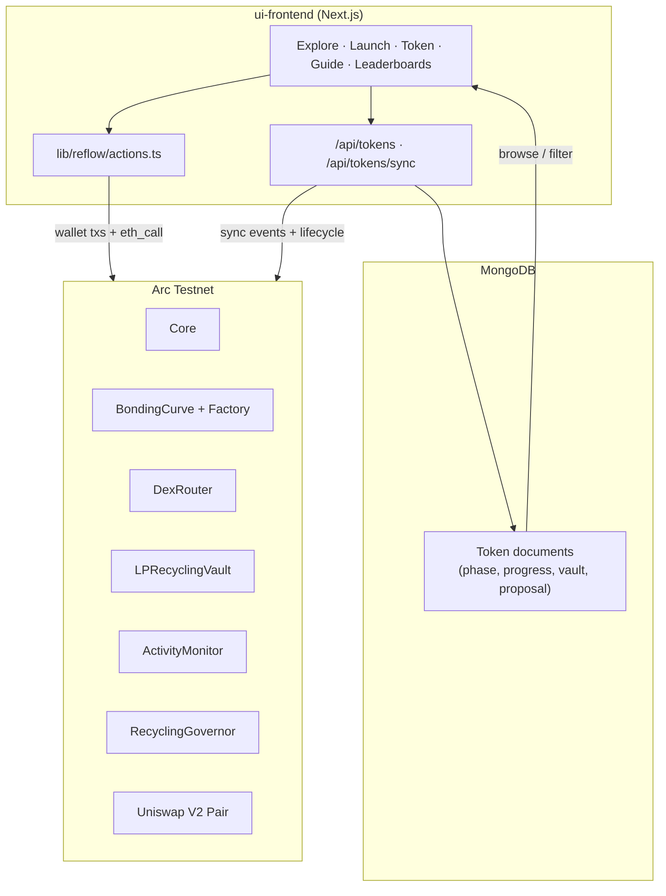
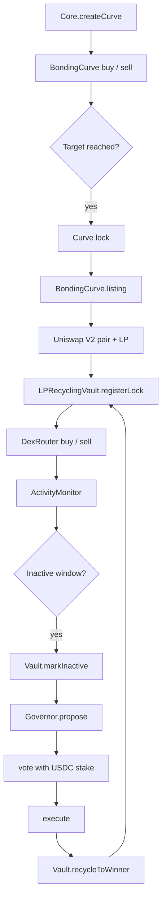
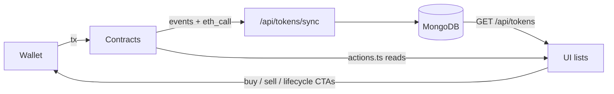

# ZUNO

Where liquidity finds its next home.

Liquidity-recycling launchpad on **Arc**.

Projects launch on a bonding curve, graduate to Uniswap V2 with **locked LP** (not burned), and if a pool goes inactive the community votes to recycle that liquidity into an active project.

```
Bond → Graduate → Lock LP → Trade → Inactive → Vote → Recycle → Lock again
```

---

## Monorepo layout

| Path | Stack | Role |
|------|--------|------|
| [`implementation/`](./implementation) | Solidity, Hardhat, Foundry | Contracts, deploy scripts, recycle tests |
| [`ui-frontend/`](./ui-frontend) | Next.js, wagmi, ethers, MongoDB | Explore / launch / trade / lifecycle UI |

Contract-level detail and step-by-step deploy live in [`implementation/README.md`](./implementation/README.md).

---

## Architecture overview



| Layer | Source of truth | Purpose |
|-------|-----------------|---------|
| **On-chain** | Core, Curve, DexRouter, Vault, Monitor, Governor | Balances, pricing, LP, inactivity, votes, recycle |
| **Mongo** | Derived index via sync | Fast explore/filter by phase; fewer RPCs on browse |
| **UI** | Hybrid | Lists from Mongo; quotes/trades/lifecycle from chain |

---

## Token lifecycle



**Phases in the UI / Mongo model**

`bonding` → `locked` → `listed` → `inactive` → `voting` → `recycling` → `recycled`

---

## Smart contracts

| Contract | Path | Role |
|----------|------|------|
| `Core` | `implementation/src/Core.sol` | Create curve; bonding buy/sell |
| `BondingCurve` / `BondingCurveFactory` | `src/BondingCurve*.sol` | Price discovery; lock; graduate to V2 |
| `Token` | `src/Token.sol` | Project ERC20 (transfer-gated until listing) |
| `DexRouter` | `src/DexRouter.sol` | Post-listing swaps; records activity |
| `WNative` / `FeeVault` | `src/` | Wrapped native + protocol fees |
| `uniswap/*` | `src/uniswap/` | Local Uniswap V2 factory / pair / router |
| `LPRecyclingVault` | `src/recycle/` | Holds graduated LP; executes recycle |
| `ActivityMonitor` | `src/recycle/` | Volume / tx / time inactivity |
| `RecyclingGovernor` | `src/recycle/` | Native-weighted propose → vote → execute |
| `ReflowV2Deployer` | `src/recycle/` | Optional one-shot deploy + wiring |

**Design choice:** `BondingCurve.listing()` does **not** burn LP. LP is sent to `LPRecyclingVault` and registered so inactive liquidity can be recycled later.

---

## Frontend architecture

```
ui-frontend/
├── app/                    # App Router pages + API routes
│   ├── (root)/             # /, /launch, /token/[id], /guide, /leaderboards, …
│   └── api/tokens/         # GET/POST list · POST sync from chain
├── components/             # Explore, trade sidebar, lifecycle, nav, …
├── config/
│   ├── reflow.ts           # Addresses + ABIs (from deployments JSON)
│   ├── chains.ts           # Arc Testnet (5042002)
│   └── wagmi.ts            # Injected wallet connector
├── lib/reflow/
│   ├── actions.ts          # create / buy / sell / list / vote / quotes / lifecycle
│   ├── provider.ts         # Public RPC
│   └── tx.ts               # sendContractTx helpers
├── lib/tokens/             # Mongo adapters + mongoSync
├── models/Token.ts         # Mongoose schema (phases mirror chain)
└── hooks/                  # useApiTokens, useReflowWallet, …
```

**Trading**

- Bonding: `Core.buy` / `Core.sell` (fee on native / output)
- Listed: `DexRouter.buy` / `DexRouter.sell`
- Quotes and market cap from virtual reserves (curve) or pair reserves (DEX)

**Wallet**

wagmi injected connector → ethers `BrowserProvider` signer for writes (`useReflowWallet`).

---

## Data flow



1. Launch or trade hits the chain.
2. Sync (manual or after lifecycle actions) indexes Create / vault / governor / progress into Mongo.
3. Explore and token pages hydrate from Mongo, then refresh live stats from chain.

---

## Network

| Network | Chain ID | RPC |
|---------|----------|-----|
| Arc Testnet | `5042002` | `https://rpc.testnet.arc.network` (override with `ARC_TESTNET_RPC_URL` / `NEXT_PUBLIC_RPC_URL`) |

Deployed addresses are saved in:

- `implementation/deployments/arcTestnet.json`
- `ui-frontend/config/deployments/arcTestnet.json`

| Contract | Address |
|----------|---------|
| Core | `0xD03883879422b20daEaE68f116771f2f36131Cfe` |
| BondingCurveFactory | `0x8133D59B8b59C1210cf6B28e7833810aA691A33a` |
| DexRouter | `0x4Cdf69D2a6D119bEEeD9B692A8aa60313A6415B0` |
| LPRecyclingVault | `0x8EC409A9197BF4CF1b42462206dCfD9002f3059B` |
| ActivityMonitor | `0xC78111BACB105433473496c232E6AD9595F80DCC` |
| RecyclingGovernor | `0xEcA274eb83E2d28cdDaCbE654d62E4B4014cd897` |

---

## Quick start

### Contracts (`implementation/`)

```bash
cd implementation
cp .env.example .env   # set PRIVATE_KEY, optional ARC_TESTNET_RPC_URL / MONGODB_URI
npm install
npx hardhat compile

# Deploy in order (01 → 11) — see implementation/README.md
# Or seed random tokens on an existing deploy:
npm run launch:random
```

### UI (`ui-frontend/`)

```bash
cd ui-frontend
cp .env.example .env.local
# MONGODB_URI, MONGODB_DB=reflow
# NEXT_PUBLIC_RPC_URL=https://rpc.testnet.arc.network
# optional NEXT_PUBLIC_MON_USD=1  (mcap display)
npm install
npm run dev
```

Open [http://localhost:3000](http://localhost:3000). Connect an injected wallet on Arc Testnet.

---

## Docs

| Doc | Contents |
|-----|----------|
| This file | Product + system architecture |
| [`implementation/README.md`](./implementation/README.md) | Contract cycle, deploy steps, usage |
| `ui-frontend/.env.example` | Frontend env vars |

---

## License

See individual packages for license terms.
